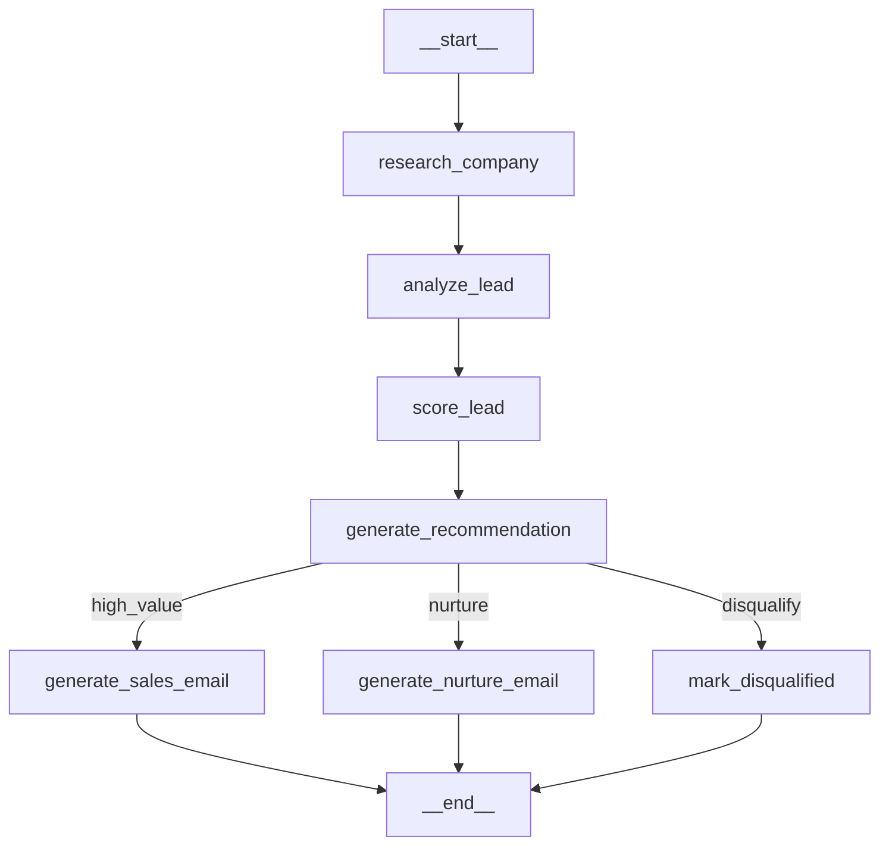

# Proyecto 2 — LangGraph: El Orquestador como Grafo

> **Prerequisito obligatorio:** Completar las 11 fases del Proyecto 1. Si no construiste el runner
> manual, no tienes el contexto para entender qué problema resuelve LangGraph.
>
> **Objetivo:** Reemplazar `app/workflow/runner.py` con un grafo de LangGraph. Tus tools, modelos,
> API, y tests de tools NO cambian. Solo el orquestador cambia.
>
> **Principio rector:** LangGraph es exactamente el patrón que construiste a mano. Esta vez lo
> declaras en lugar de programarlo. Si no puedes señalar la equivalencia entre cada parte de tu
> runner.py y su contraparte en LangGraph, no lo entendiste.

---

## Cómo usar este plan

Misma estructura que el Proyecto 1:

- **Concepto central** — lo que vas a aprender de verdad
- **Lo que construyes** — qué archivos existen al final
- **Ejercicio de entendimiento** — pregunta que debes poder responder sin ver el código
- **Señal de que puedes avanzar** — cómo saber que la fase está realmente terminada
- **Trampas comunes** — qué evitar

La diferencia: en este proyecto ya tienes código funcionando. Cada fase modifica el orquestador
existente. Al terminar, `uv run pytest` debe pasar con exactamente los mismos tests (o tests
actualizados) que tenías al terminar el Proyecto 1.

---

## Mapa mental antes de empezar

Antes de escribir una línea de LangGraph, entiende esta equivalencia:

| Lo que construiste en Proyecto 1           | Su equivalente en LangGraph                    |
|---------------------------------------------|------------------------------------------------|
| `run_workflow(lead) -> WorkflowState`        | `graph.invoke(state_dict)`                     |
| `state = research_company(state)`            | `graph.add_node("research_company", fn)`       |
| `state = analyze_lead(state)` (siguiente)    | `graph.add_edge("research_company", "analyze_lead")` |
| `route = route_by_score(state)`              | `graph.add_conditional_edges("score_lead", route_by_score, {...})` |
| El `for tool in tools: state = tool(state)` | `graph.compile().invoke(state)`                |
| `state.workflow_status = "failed"`           | Checkpointing con estado de error guardado     |
| Tu `leads.db` con estado serializado        | `SqliteSaver` / `MemorySaver` de LangGraph     |

Si esta tabla tiene sentido, el proyecto va a fluir. Si no, relees tu `runner.py` primero.

---

## Fase 0 — LangGraph como dependencia: qué es y qué NO es

**Concepto central:** LangGraph no es LangChain. Es una librería separada de bajo nivel para
construir grafos de agentes con estado. No necesitas LangChain para usar LangGraph.

### Lo que haces

```bash
cd ai-lead-qualification
uv add langgraph
```

Verifica qué instaló:

```bash
uv pip show langgraph
```

Luego abre el REPL e importa lo mínimo para entender la superficie:

```python
from langgraph.graph import StateGraph, START, END
print(StateGraph)  # es una clase, no magia
```

### El paisaje del paquete

```
langgraph               — el grafo de orquestación (lo que usas)
langgraph-checkpoint    — persistencia de estado (checkpointing)
langgraph-checkpoint-sqlite — implementación SQLite del checkpointer
langchain-core          — tipos base compartidos (puedes ignorar por ahora)
langchain               — NO lo necesitas para este proyecto
```

`uv add langgraph` instala `langgraph` y `langgraph-checkpoint` como dependencias. El SQLite
checkpointer es opcional: `uv add langgraph-checkpoint-sqlite` si lo necesitas.

### Lo que NO cambia

```
app/domain/models.py    — no tocar
app/workflow/tools.py   — no tocar
app/workflow/routing.py — no tocar (todavía)
app/storage/            — no tocar
app/api/                — no tocar
tests/                  — no tocar todavía
```

### Ejercicio de entendimiento

- ¿Cuál es la diferencia entre LangGraph y LangChain? (Investiga, no adivines)
- ¿Por qué importamos `START` y `END` de LangGraph en lugar de definirlos nosotros?

### Señal de que puedes avanzar

`from langgraph.graph import StateGraph, START, END` sin errores en el REPL. Puedes describir en
una oración qué hace LangGraph sin mencionar LangChain.

### Trampas comunes

- No instales `langchain` pensando que lo necesitas. `uv add langgraph` es suficiente.
- LangGraph tiene versiones que cambian la API con frecuencia. Si ves tutoriales con
  `from langchain.graphs import ...`, están desactualizados.
- `StateGraph` y `Graph` son distintos. Usa siempre `StateGraph` — soporta estado tipado.

---

## Fase 1 — Tu primer StateGraph: lineal sin routing

**Concepto central:** Un `StateGraph` es una máquina de estados declarativa. Declaras los nodos
(funciones), los conectas con edges (flechas), y compilas. El grafo hace el resto.

### Lo que construyes

Crea `app/workflow/graph.py` — este archivo va a reemplazar eventualmente a `runner.py`:

```python
from langgraph.graph import StateGraph, START, END
from app.domain.models import WorkflowState
from app.workflow.tools import (
    research_company, analyze_lead, score_lead,
    generate_recommendation, generate_sales_email,
)

def build_graph():
    graph = StateGraph(WorkflowState)

    graph.add_node("research_company", research_company)
    graph.add_node("analyze_lead", analyze_lead)
    graph.add_node("score_lead", score_lead)
    graph.add_node("generate_recommendation", generate_recommendation)
    graph.add_node("generate_sales_email", generate_sales_email)

    graph.add_edge(START, "research_company")
    graph.add_edge("research_company", "analyze_lead")
    graph.add_edge("analyze_lead", "score_lead")
    graph.add_edge("score_lead", "generate_recommendation")
    graph.add_edge("generate_recommendation", "generate_sales_email")
    graph.add_edge("generate_sales_email", END)

    return graph.compile()
```

Prueba esto en el REPL antes de integrarlo:

```python
from app.workflow.graph import build_graph
from app.domain.models import Lead, WorkflowState

graph = build_graph()
lead = Lead(
    company_name="Acme",
    website="acme.com",
    contact_name="John",
    contact_email="john@acme.com"
)
state = WorkflowState(lead=lead)
result = graph.invoke(state)
print(result.workflow_status)
```

### La firma de las funciones de nodo

LangGraph espera que cada nodo sea una función que recibe el estado y devuelve una actualización
del estado. Tu firma `(state: WorkflowState) -> WorkflowState` es compatible directamente.

LangGraph internamente hace esto con cada nodo:
```python
# Lo que LangGraph hace por ti:
new_state = your_function(current_state)
current_state = new_state  # reemplaza el estado completo
```

### Estructura al final de la fase

```
app/workflow/
├── graph.py       # nuevo: el grafo lineal
├── runner.py      # todavía existe, no lo borres aún
├── tools.py       # sin cambios
└── routing.py     # sin cambios
```

### Ejercicio de entendimiento

- En tu `runner.py`, tienes `state = research_company(state)`. ¿Cuál es la línea equivalente
  en LangGraph? (No es una sola línea, son dos: una en `add_node` y una en `add_edge`)
- ¿Qué pasa si llamas `graph.add_edge("score_lead", "analyze_lead")` y también
  `graph.add_edge("analyze_lead", "score_lead")`? ¿LangGraph lo detecta?
- `START` y `END` no son nodos con función. ¿Qué son exactamente?

### Señal de que puedes avanzar

`graph.invoke(state)` devuelve un `WorkflowState` con `workflow_status == "completed"`. Puedes
comparar el output con el de `run_workflow()` de tu runner.py — deben ser equivalentes.

### Trampas comunes

- `graph.invoke()` espera el estado inicial como primer argumento. Si le pasas solo el `Lead`
  en lugar del `WorkflowState`, obtendrás errores de validación.
- `StateGraph(WorkflowState)` — el argumento es el **tipo** de tu estado, no una instancia.
- Si no agregas `graph.add_edge(START, "primer_nodo")`, el grafo no sabe por dónde empezar.
  El error es confuso: `GraphRecursionError` o simplemente no ejecuta nada.
- No confundas `graph` (el builder) con `graph.compile()` (el ejecutable). Solo el compilado
  tiene el método `invoke()`.

---

## Fase 2 — Estado en LangGraph: TypedDict vs tu WorkflowState Pydantic

**Concepto central:** LangGraph fue diseñado originalmente para TypedDict. Funciona con Pydantic,
pero necesitas entender la diferencia para no tener bugs silenciosos relacionados con cómo el
grafo actualiza el estado.

### El problema que aparece

En LangGraph, cada nodo puede devolver **el estado completo** o **solo los campos que cambiaron**.
Con TypedDict, LangGraph hace un merge (actualización parcial). Con Pydantic, el comportamiento
depende de la versión y configuración.

Experimenta esto en el REPL:

```python
# Con TypedDict — LangGraph hace merge parcial
from typing import TypedDict

class MyState(TypedDict):
    a: int
    b: str

# Si un nodo devuelve solo {"a": 99}, el campo "b" se preserva

# Con Pydantic — LangGraph reemplaza el estado completo
from pydantic import BaseModel

class MyState(BaseModel):
    a: int
    b: str

# Si un nodo devuelve WorkflowState(a=99, b=None), "b" se pierde
```

### Por qué esto no fue un problema en el Proyecto 1

Tu runner.py siempre devolvía el estado completo: `return state` al final de cada tool. Tus tools
nunca devuelven un estado parcial. Por eso funciona con Pydantic directamente.

La regla: **si tus tools siempre devuelven el WorkflowState completo, Pydantic funciona**.
Si en algún momento quieres que una tool solo actualice un campo (retornando un dict parcial),
necesitas usar TypedDict o el patrón de reducers.

### Lo que construyes en esta fase

Nada nuevo de código. En cambio, **escribes un test** que verifica que el estado se preserva
correctamente a través de dos nodos:

```python
# tests/test_graph.py
def test_state_preserved_across_nodes(sample_lead):
    """Verifica que los datos del lead no se borran entre nodos."""
    state = WorkflowState(lead=sample_lead)
    state.research = ResearchResult(industry="Tech", estimated_size="100", potential_needs=[], summary=".")

    with patch("app.workflow.tools.research_company", return_value=state) as mock_fn:
        # mock_fn debe recibir el state con research ya poblado
        pass

    assert state.lead.company_name == sample_lead.company_name
    assert state.research is not None  # no se perdió en el nodo
```

### El patrón de reducers (para saber que existe, no para usarlo ahora)

Si en el futuro quisieras que un campo se **acumule** en lugar de reemplazarse (como un log de
eventos), LangGraph tiene el patrón de reducers:

```python
from typing import Annotated
import operator

class MyState(TypedDict):
    messages: Annotated[list, operator.add]  # cada nodo AGREGA al list, no lo reemplaza
    score: int                                # este sí se reemplaza
```

No lo implementes ahora. Solo entiende que existe.

### Ejercicio de entendimiento

- ¿Cuándo usarías TypedDict en lugar de Pydantic para el estado de LangGraph?
- En tu `WorkflowState`, tienes `execution_log: list[LogEntry]`. Si un nodo devuelve el state
  completo con un nuevo LogEntry, ¿qué pasa con los LogEntries anteriores?
- ¿Qué ventaja tiene el patrón `Annotated[list, operator.add]` para logs de ejecución?

### Señal de que puedes avanzar

Puedes explicar en voz alta cuándo el estado se perdería silenciosamente en LangGraph y por qué
tu implementación actual lo evita. Puedes describir cuándo cambiarías de Pydantic a TypedDict.

### Trampas comunes

- No asumas que LangGraph "fusiona" dicts automáticamente con Pydantic. Verifica siempre.
- El patrón `Annotated[list, operator.add]` es para TypedDict. Con Pydantic, si quieres el
  mismo comportamiento, tienes que hacerlo manualmente en la tool.
- Los reducers son poderosos pero añaden complejidad. No los uses hasta que tengas un problema
  concreto que requieran.

---

## Fase 3 — Conditional edges: tu routing.py se convierte en el grafo

**Concepto central:** En tu runner.py, el routing era código imperativo (`if/elif/else`). En
LangGraph, el routing son `conditional_edges` — declaras las posibles rutas y LangGraph las
sigue automáticamente.

### Lo que construyes

Modifica `app/workflow/graph.py` para incluir el routing real:

```python
from langgraph.graph import StateGraph, START, END
from app.domain.models import WorkflowState
from app.workflow.tools import (
    research_company, analyze_lead, score_lead,
    generate_recommendation, generate_sales_email,
    generate_nurture_email, mark_disqualified,
)
from app.workflow.routing import route_by_score

def build_graph():
    graph = StateGraph(WorkflowState)

    # Nodos: exactamente tus tools existentes
    graph.add_node("research_company", research_company)
    graph.add_node("analyze_lead", analyze_lead)
    graph.add_node("score_lead", score_lead)
    graph.add_node("generate_recommendation", generate_recommendation)
    graph.add_node("generate_sales_email", generate_sales_email)
    graph.add_node("generate_nurture_email", generate_nurture_email)
    graph.add_node("mark_disqualified", mark_disqualified)

    # Edges lineales hasta score_lead
    graph.add_edge(START, "research_company")
    graph.add_edge("research_company", "analyze_lead")
    graph.add_edge("analyze_lead", "score_lead")
    graph.add_edge("score_lead", "generate_recommendation")

    # Conditional edge: routing_by_score decide qué nodo va después
    graph.add_conditional_edges(
        "generate_recommendation",
        route_by_score,
        {
            "high_value": "generate_sales_email",
            "nurture": "generate_nurture_email",
            "disqualify": "mark_disqualified",
        }
    )

    # Los tres terminan en END
    graph.add_edge("generate_sales_email", END)
    graph.add_edge("generate_nurture_email", END)
    graph.add_edge("mark_disqualified", END)

    return graph.compile()
```

### La firma de route_by_score no cambia

Tu función existente en `routing.py` ya tiene la firma correcta:

```python
def route_by_score(state: WorkflowState) -> str:
    if state.lead_score.score >= 70:
        return "high_value"
    elif state.lead_score.score >= 40:
        return "nurture"
    else:
        return "disqualify"
```

LangGraph llama a esta función después de `generate_recommendation`, recibe el string, y lo
busca en el diccionario del `add_conditional_edges`. Exactamente lo que tu runner.py hacía
con el `if route == "high_value":`.

### Visualiza el grafo que acabas de declarar

```python
from app.workflow.graph import build_graph

graph = build_graph()
print(graph.get_graph().draw_ascii())
```

Deberías ver algo como:

```
    +-----------+
    | __start__ |
    +-----------+
          |
          v
+------------------+
| research_company |
+------------------+
          |
          v
  +--------------+
  | analyze_lead |
  +--------------+
          |
          v
  +------------+
  | score_lead |
  +------------+
          |
          v
+-------------------------+
| generate_recommendation |
+-------------------------+
     /        |        \
    v         v         v
+--------+  +-------+  +-----+
| sales  |  |nurture|  |disq.|
+--------+  +-------+  +-----+
```

Esto es imposible de obtener con tu runner.py manual. El grafo se auto-documenta.

### Estructura al final de la fase

```
app/workflow/
├── graph.py       # grafo completo con routing
├── runner.py      # todavía existe, ambos coexisten
├── tools.py       # sin cambios
└── routing.py     # sin cambios (misma función, nuevo uso)
```

### Ejercicio de entendimiento

- En tu runner.py, el routing ocurre **después** de `score_lead`. En el grafo, el conditional
  edge sale de `generate_recommendation`. ¿Por qué moviste el punto de routing? ¿Qué pasa si
  lo pones después de `score_lead` directamente?
- ¿Qué pasa si `route_by_score` devuelve un string que no está en el diccionario del
  `add_conditional_edges`? ¿Error en compile-time o en runtime?
- ¿Cómo sabrías en un test que el workflow tomó la ruta `"nurture"` en lugar de `"high_value"`?

### Señal de que puedes avanzar

`graph.get_graph().draw_ascii()` muestra el grafo con las tres ramas. Puedes crear un lead
con score alto y verificar que el grafo toma el path `generate_sales_email`. Puedes crear otro
con score bajo y verificar el path `mark_disqualified`. Todo sin llamar a OpenAI (usa mocks o
un WorkflowState con estado pre-poblado).

### Trampas comunes

- El diccionario en `add_conditional_edges` mapea **string → nombre de nodo**. Si el nombre
  del nodo no coincide exactamente (typo), falla en runtime con `KeyError`, no en compile time.
- Si olvidas `graph.add_edge("generate_sales_email", END)` para uno de los tres branches, el
  grafo compila pero entra en loop infinito o lanza `GraphRecursionError`.
- `route_by_score` en el conditional edge es llamada por LangGraph con el estado actual. No
  la llames tú mismo dentro del grafo — LangGraph ya lo hace.

---

## Fase 4 — Compilación, invocación, y reemplazar runner.py

**Concepto central:** `graph.compile()` convierte el builder en un ejecutable. `graph.invoke()`
ejecuta el grafo de principio a fin. Esta es la transición de tener dos orquestadores a tener uno.

### Lo que construyes

Reemplaza el contenido de `app/workflow/runner.py` para usar el grafo:

```python
from app.domain.models import Lead, WorkflowState
from app.workflow.graph import build_graph
from app.storage.repository import save_execution

_graph = build_graph()

def run_workflow(lead: Lead) -> WorkflowState:
    state = WorkflowState(lead=lead)
    result = _graph.invoke(state)
    save_execution(result)
    return result
```

`run_tool()`, el loop manual, los logs por fase — todo eso desaparece. El grafo lo maneja.

### Qué perdiste y qué ganaste

**Perdiste:**
- El logging granular de `run_tool()` (cuánto tardó cada tool exactamente)
- El control explícito de qué hacer cuando una tool falla

**Ganaste:**
- Routing declarativo
- Visualización automática del grafo
- La base para checkpointing, streaming, y human-in-the-loop

Más adelante en este proyecto recuperarás el logging via streaming.

### El `_graph` como singleton

`build_graph()` compila el grafo una vez al importar el módulo. No lo recompiles en cada llamada.
El grafo compilado es thread-safe para múltiples invocaciones concurrentes.

### Estructura al final de la fase

```
app/workflow/
├── graph.py       # grafo completo (el trabajo real)
├── runner.py      # wrapper delgado: llama graph.invoke(), guarda estado
├── tools.py       # sin cambios
└── routing.py     # sin cambios
```

### Ejercicio de entendimiento

- En el runner.py anterior, el manejo de errores (try/except con `workflow_status = "failed"`)
  estaba en `run_tool()`. Ahora que no existe ese wrapper, ¿qué pasa cuando una tool lanza
  una excepción? ¿El grafo lo propaga? ¿Lo maneja?
- ¿Por qué guardamos `_graph` como módulo-level en lugar de crear `build_graph()` en cada
  llamada a `run_workflow()`?
- Si FastAPI llama a `run_workflow(lead)` desde un endpoint, ¿qué cambió en la API? ¿Nada?

### Señal de que puedes avanzar

`uv run python main.py` (o el equivalente CLI) corre el workflow completo. `uv run pytest`
tiene algunos tests fallando (los de `runner.py` que mockeaban `run_tool` específicamente) — eso
está bien, los vas a actualizar en la Fase 8. El flujo principal funciona.

### Trampas comunes

- `graph.invoke(state)` donde `state` es un `WorkflowState` — si LangGraph no puede serializar
  tu Pydantic model internamente, necesitas pasarlo como `state.model_dump()` y reconstruirlo al
  final.
- Si tienes `leads.db` de ejecuciones anteriores con el schema anterior, puede haber conflictos.
  Borra `leads.db` y deja que `init_db()` lo recree.
- No borres `runner.py` — FastAPI y `main.py` lo importan. Solo cambia su implementación.

---

## Fase 5 — Streaming: ver el estado después de cada nodo

**Concepto central:** `graph.stream()` es como `graph.invoke()` pero emite el estado después de
cada nodo. Esto te da visibilidad en tiempo real que era imposible con el runner.py manual.

### Lo que construyes

Un script de diagnóstico temporal en `scripts/stream_workflow.py`:

```python
from app.domain.models import Lead, WorkflowState
from app.workflow.graph import build_graph
from app.core.observability import configure_logging
import json

configure_logging()
graph = build_graph()

lead = Lead(
    company_name="Acme Corp",
    website="acme.com",
    contact_name="John Doe",
    contact_email="john@acme.com"
)

state = WorkflowState(lead=lead)

for step in graph.stream(state, stream_mode="values"):
    # step es el WorkflowState completo después de cada nodo
    populated = [k for k, v in step.model_dump().items() if v is not None]
    print(f"Estado después del nodo: {populated}")
```

Y en `main.py`, una opción para modo verbose que use streaming:

```python
if "--stream" in sys.argv:
    for step in graph.stream(state, stream_mode="values"):
        node_just_ran = step.execution_log[-1].tool if step.execution_log else "start"
        print(f"[{node_just_ran}] completado")
```

### Los modos de stream

```python
# stream_mode="updates" (default) — emite solo los campos que cambiaron en cada nodo
for update in graph.stream(state, stream_mode="updates"):
    print(update)  # dict con solo los campos modificados

# stream_mode="values" — emite el estado completo después de cada nodo
for full_state in graph.stream(state, stream_mode="values"):
    print(full_state.workflow_status)  # WorkflowState completo

# stream_mode="debug" — emite eventos internos del grafo (más verboso)
```

Para debugging, `"values"` es el más útil. Para producción con payloads grandes, `"updates"`.

### Por qué esto importa para sistemas agénticos

En un workflow de 7 tools que tarda 30 segundos, el usuario espera sin feedback. Con streaming
puedes mostrar progreso real: "Investigando empresa... Analizando lead... Calculando score..."

Esto no era posible con el runner.py manual sin modificar cada tool o el wrapper.

### Estructura al final de la fase

```
ai-lead-qualification/
├── scripts/
│   └── stream_workflow.py   # script de diagnóstico
└── main.py                  # opción --stream
```

### Ejercicio de entendimiento

- ¿Cuál es la diferencia entre `stream_mode="updates"` y `stream_mode="values"`?
- Si tu workflow tiene 7 nodos, ¿cuántas veces itera el for-loop con streaming?
- ¿Cómo recuperarías el estado final del workflow usando streaming (sin llamar a `invoke()`
  al final)?

### Señal de que puedes avanzar

`uv run python scripts/stream_workflow.py` imprime el estado después de cada nodo, mostrando
cómo se acumulan los campos. Puedes ver en tiempo real cuándo se popula `research`, `analysis`,
`lead_score`, etc.

### Trampas comunes

- `graph.stream()` es un generador — si no lo iteras, no ejecuta nada.
- Con `stream_mode="updates"`, lo que recibes es un dict del nodo hacia sus cambios, no el
  estado completo. La forma es `{"nombre_nodo": {campos_cambiados}}`.
- No uses streaming en tests — es más difícil de mockear que `invoke()`. Los tests siguen
  usando `graph.invoke()`.

---

## Fase 6 — Checkpointing: persistencia integrada de LangGraph

**Concepto central:** LangGraph tiene su propio sistema de persistencia de estado llamado
"checkpointing". Es diferente a tu `storage/repository.py` — no es para business data, es para
poder **reanudar** un workflow interrumpido desde el punto exacto donde se detuvo.

### La diferencia fundamental

| Tu `storage/repository.py`               | LangGraph checkpointing                        |
|------------------------------------------|------------------------------------------------|
| Guarda el estado final (o de falla)      | Guarda el estado después de CADA nodo          |
| Para historial de business               | Para resumption y human-in-the-loop            |
| Tu schema: `WorkflowExecutionORM`        | Schema interno de LangGraph                    |
| Tú decides cuándo guardar                | LangGraph guarda automáticamente               |

Ambos pueden coexistir. Tu repository guarda para reportes. El checkpointer guarda para control
de flujo.

### Lo que construyes

Modifica `app/workflow/graph.py` para aceptar un checkpointer opcional:

```python
from langgraph.graph import StateGraph, START, END
from langgraph.checkpoint.memory import MemorySaver

def build_graph(checkpointer=None):
    graph = StateGraph(WorkflowState)
    # ... (mismos nodos y edges de antes) ...
    return graph.compile(checkpointer=checkpointer)

# Para desarrollo/testing: sin checkpointing
production_graph = build_graph()

# Para funcionalidades que lo requieren (human-in-the-loop):
memory_graph = build_graph(checkpointer=MemorySaver())
```

Cuando usas checkpointing, `invoke()` y `stream()` requieren un `config` con `thread_id`:

```python
config = {"configurable": {"thread_id": state.execution_id}}
result = graph_with_checkpointer.invoke(state, config=config)
```

### MemorySaver vs SqliteSaver

```python
# MemorySaver: en memoria, muere con el proceso. Solo para desarrollo.
from langgraph.checkpoint.memory import MemorySaver
saver = MemorySaver()

# SqliteSaver: persiste en disco. Para producción.
from langgraph.checkpoint.sqlite import SqliteSaver
with SqliteSaver.from_conn_string("checkpoints.db") as saver:
    graph = build_graph(checkpointer=saver)
    result = graph.invoke(state, config={"configurable": {"thread_id": "exec-123"}})
```

La ironía: LangGraph también usa SQLite por dentro. La diferencia es que el schema del
checkpointer es controlado por LangGraph, no por ti.

### Inspeccionando el estado guardado

```python
# Ver el estado actual de un thread
state_snapshot = graph_with_checkpointer.get_state(config)
print(state_snapshot.values)  # el WorkflowState en ese punto

# Ver el historial de checkpoints de un thread
for checkpoint in graph_with_checkpointer.get_state_history(config):
    print(checkpoint.metadata)
```

### Ejercicio de entendimiento

- Si un workflow falla en `score_lead` (el cuarto nodo de siete), ¿desde qué punto puedes
  reanudarlo con checkpointing? ¿Puedes reanudarlo desde `score_lead` directamente, o tienes
  que empezar desde `research_company`?
- ¿Qué es un `thread_id` en LangGraph? ¿A qué se parece en tu sistema actual?
- Si usas `MemorySaver` en producción y el servidor se reinicia, ¿qué pasa con los checkpoints?

### Señal de que puedes avanzar

Puedes crear un grafo con `MemorySaver`, ejecutarlo hasta la mitad (interrumpir artificialmente),
e inspeccionar el estado guardado con `get_state()`. Puedes describir en qué se diferencia
el checkpointer de tu `repository.py`.

### Trampas comunes

- Si usas checkpointing, **siempre** debes pasar `config={"configurable": {"thread_id": "..."}}`.
  Sin el `thread_id`, LangGraph no sabe dónde guardar ni de dónde recuperar.
- `MemorySaver` no es thread-safe entre procesos. Si tienes dos workers de FastAPI, cada uno
  tiene su propia memoria. Usa `SqliteSaver` o un checkpointer de PostgreSQL para producción.
- El `SqliteSaver` crea su propio archivo `.db` con su propio schema. No lo uses como
  reemplazo de tu `leads.db` — son dos cosas distintas con propósitos distintos.
- No checkpointes todos los grafos por default. El overhead de checkpointing es real.
  Solo úsalo cuando necesites resumption o human-in-the-loop.

---

## Fase 7 — Human-in-the-loop: interrumpir y reanudar

**Concepto central:** Un workflow agéntico puede pausarse antes de una acción crítica y esperar
input humano. Esta es una de las características más importantes de LangGraph y una de las más
difíciles de implementar sin un framework.

### El caso de uso

Antes de enviar el email de ventas, un humano aprueba (o modifica) el contenido:

```
research → analyze → score → recommend → [PAUSA: humano revisa] → generate_sales_email → END
```

Sin LangGraph: habrías necesitado guardar estado, exponer un endpoint, y luego reanudar
manualmente. Con LangGraph: son dos líneas de configuración.

### Lo que construyes

Un grafo con interrupción antes de `generate_sales_email`:

```python
def build_graph_with_approval(checkpointer):
    graph = StateGraph(WorkflowState)

    # Mismos nodos...
    graph.add_node("research_company", research_company)
    graph.add_node("analyze_lead", analyze_lead)
    graph.add_node("score_lead", score_lead)
    graph.add_node("generate_recommendation", generate_recommendation)
    graph.add_node("generate_sales_email", generate_sales_email)
    graph.add_node("generate_nurture_email", generate_nurture_email)
    graph.add_node("mark_disqualified", mark_disqualified)

    # Mismos edges...
    graph.add_edge(START, "research_company")
    graph.add_edge("research_company", "analyze_lead")
    graph.add_edge("analyze_lead", "score_lead")
    graph.add_edge("score_lead", "generate_recommendation")
    graph.add_conditional_edges(
        "generate_recommendation",
        route_by_score,
        {"high_value": "generate_sales_email", "nurture": "generate_nurture_email", "disqualify": "mark_disqualified"}
    )
    graph.add_edge("generate_sales_email", END)
    graph.add_edge("generate_nurture_email", END)
    graph.add_edge("mark_disqualified", END)

    # La interrupción: pausa ANTES de generate_sales_email
    return graph.compile(
        checkpointer=checkpointer,
        interrupt_before=["generate_sales_email"]
    )
```

El flujo de uso:

```python
from langgraph.checkpoint.memory import MemorySaver

saver = MemorySaver()
graph = build_graph_with_approval(saver)

config = {"configurable": {"thread_id": "aprobacion-001"}}
state = WorkflowState(lead=lead)

# Paso 1: ejecuta hasta la pausa
partial_result = graph.invoke(state, config=config)
# El grafo paró antes de generate_sales_email
print("Score:", partial_result.lead_score.score)
print("Recommendation:", partial_result.recommendation.route)

# El humano revisa y aprueba...
print("¿Aprobas el email? (s/n):")
if input().lower() == "s":
    # Paso 2: reanuda desde donde se quedó
    final_result = graph.invoke(None, config=config)  # None = usa estado guardado
    print("Email enviado:", final_result.email_draft.subject)
```

### Ver el estado antes de reanudar

```python
# Después de la pausa, puedes inspeccionar el estado
snapshot = graph.get_state(config)
print(snapshot.next)          # ['generate_sales_email'] — el nodo pendiente
print(snapshot.values)        # el WorkflowState actual
print(snapshot.metadata)      # metadatos del checkpoint
```

### Por qué `graph.invoke(None, config=config)` funciona

`None` como primer argumento le dice a LangGraph: "no hay nuevo input, reanuda desde el
checkpoint asociado a este `thread_id`". El checkpointer recupera el estado guardado y continúa
desde el nodo interrumpido.

### Integración con FastAPI

```python
# POST /leads/{id}/approve — reanuda el workflow pausado
@router.post("/leads/{execution_id}/approve")
async def approve_lead(execution_id: str):
    config = {"configurable": {"thread_id": execution_id}}
    result = approval_graph.invoke(None, config=config)
    return {"status": result.workflow_status}
```

### Ejercicio de entendimiento

- ¿Qué pasa si usas `interrupt_before=["generate_sales_email"]` pero el lead resulta ser
  `"nurture"` y el routing va a `"generate_nurture_email"`? ¿Se interrumpe igual?
- ¿Por qué `graph.invoke(None, config=config)` y no `graph.invoke(saved_state, config=config)`?
- ¿Cuántos checkpoints crea LangGraph para un workflow que se ejecuta con una interrupción?

### Señal de que puedes avanzar

Puedes ejecutar el workflow con interrupción en el REPL, pausarlo, inspeccionar el estado con
`get_state()`, y reanudarlo. El email final existe en el resultado. Puedes describir qué
contiene `snapshot.next` antes y después de reanudar.

### Trampas comunes

- `interrupt_before` requiere checkpointing obligatoriamente. Si usas `graph.compile()` sin
  `checkpointer`, la interrupción no puede guardarse y el grafo lanza error.
- Después de la interrupción, el `invoke()` de reanudación devuelve el **estado final**, no
  el estado donde se pausó. Si quieres el estado de la pausa, usa `get_state()` antes de reanudar.
- `interrupt_before=["generate_sales_email"]` interrumpe ANTES de ese nodo. Si quieres
  interrumpir después (para revisar el email generado antes de confirmarlo), usa
  `interrupt_after=["generate_sales_email"]`.
- En tests, evita usar `interrupt_before`. Es difícil de mockear. Testea el grafo completo
  o testea los nodos individuales.

---

## Fase 8 — Manejo de errores en el grafo

**Concepto central:** En tu runner.py tenías `run_tool()` que atrapaba excepciones y marcaba
el workflow como `"failed"`. El grafo de LangGraph propaga excepciones por default. Necesitas
una estrategia explícita.

### Las tres opciones

**Opción A: Manejo dentro de cada tool (lo que ya tienes)**

Tu decorador `@with_retry(max_attempts=3)` ya atrapa errores. Si todos los reintentos fallan,
el decorador puede establecer `state.workflow_status = "failed"` y devolver el estado. LangGraph
continúa con ese estado (hacia END o el siguiente nodo).

El problema: si el tool falla silenciosamente (devuelve estado de error sin lanzar excepción),
el grafo no sabe que falló y sigue ejecutando tools subsecuentes con datos incorrectos.

**Opción B: Excepción + manejo en runner.py**

```python
def run_workflow(lead: Lead) -> WorkflowState:
    state = WorkflowState(lead=lead)
    try:
        result = _graph.invoke(state)
    except Exception as e:
        state.workflow_status = "failed"
        state.error = str(e)
        save_execution(state)
        return state
    save_execution(result)
    return result
```

Simple. Pero pierdes granularidad — no sabes en qué nodo falló.

**Opción C: Nodo de error explícito**

```python
def handle_error(state: WorkflowState) -> WorkflowState:
    state.workflow_status = "failed"
    save_execution(state)
    return state

graph.add_node("handle_error", handle_error)

# Los nodos que pueden fallar tienen un edge alternativo al nodo de error
# (requiere que detecten el fallo y lo señalicen en el estado)
```

### Lo que construyes

Para este proyecto, usa la **Opción B** con una mejora: captura el nombre del nodo que falló.

LangGraph incluye el traceback en la excepción. Puedes extraer el nombre del nodo:

```python
def run_workflow(lead: Lead) -> WorkflowState:
    state = WorkflowState(lead=lead)
    try:
        result = _graph.invoke(state)
        save_execution(result)
        return result
    except Exception as e:
        # El traceback de LangGraph incluye el nombre del nodo
        failed_node = extract_failed_node(e)  # helper que parsea el traceback
        state.workflow_status = "failed"
        state.failed_at_tool = failed_node
        state.error = str(e)
        save_execution(state)
        return state
```

### Ejercicio de entendimiento

- Con el runner.py anterior, `run_tool()` sabía exactamente qué tool falló porque lo llamaba
  explícitamente. ¿Cómo sabes ahora en qué nodo falló el grafo?
- Si `research_company` falla y el grafo lanza excepción, ¿`analyze_lead` se ejecuta?
- ¿Cuál es la ventaja de la Opción C (nodo de error) sobre la Opción B?

### Señal de que puedes avanzar

Si fuerzas una excepción en `research_company` (con un mock), el workflow termina en estado
`"failed"` y el estado se guarda en la base de datos. El test `test_failed_tool_stops_workflow`
sigue pasando.

### Trampas comunes

- No intentes replicar exactamente el comportamiento de `run_tool()` de tu runner.py anterior.
  LangGraph tiene su propio modelo de errores. Adáptate a él.
- Si usas checkpointing y el grafo falla, el checkpoint del estado de error se guarda. Esto
  puede ser útil o confuso dependiendo de si planeas reanudar desde errores.
- `@with_retry` en los tools puede ocultar errores reales. Si el retry agota los intentos y
  devuelve el estado con `workflow_status = "failed"` en lugar de lanzar excepción, el grafo
  sigue corriendo los nodos siguientes con un estado corrupto.

---

## Fase 9 — Actualizar los tests

**Concepto central:** Los tests de tools no cambian. Los tests del orquestador sí cambian,
porque el orquestador es ahora el grafo.

### Lo que NO cambia

```
tests/test_models.py    — sin cambios (testea modelos Pydantic)
tests/test_tools.py     — sin cambios (testea tools directamente con mocks)
tests/test_routing.py   — sin cambios (testea route_by_score con estados fabricados)
tests/test_storage.py   — sin cambios (testea repository con SQLite en memoria)
```

### Lo que sí cambia: test_workflow.py

Los tests que mockeaban `app.workflow.runner.research_company` directamente siguen funcionando
si tu `runner.py` llama al grafo y el grafo llama a las tools desde el mismo módulo. Pero
verifica que los patches apunten al lugar correcto:

```python
# Si el grafo importa tools así:
# from app.workflow.tools import research_company
# El patch va en:
with patch("app.workflow.tools.research_company", return_value=...):
    pass

# Si el grafo los importa en graph.py:
# El patch va en app.workflow.graph.research_company
with patch("app.workflow.graph.research_company", return_value=...):
    pass
```

La regla: **parchea donde el objeto ES USADO, no donde está definido**.

### Añadir tests del grafo

```python
# tests/test_graph.py
from langgraph.graph import StateGraph
from app.workflow.graph import build_graph

def test_graph_compiles():
    """El grafo debe compilar sin errores."""
    graph = build_graph()
    assert graph is not None

def test_graph_has_expected_nodes():
    """Verifica la estructura del grafo."""
    graph = build_graph()
    nodes = set(graph.get_graph().nodes.keys())
    assert "research_company" in nodes
    assert "score_lead" in nodes
    assert "generate_sales_email" in nodes

def test_graph_runs_high_value_path(sample_lead):
    """Test end-to-end del path high_value con mocks."""
    high_value_state = make_state_with_score(sample_lead, score=85)
    final_state = ...  # estado con email generado

    with patch("app.workflow.tools.research_company", return_value=high_value_state), \
         patch("app.workflow.tools.analyze_lead", return_value=high_value_state), \
         patch("app.workflow.tools.score_lead", return_value=high_value_state), \
         patch("app.workflow.tools.generate_recommendation", return_value=final_state), \
         patch("app.workflow.tools.generate_sales_email", return_value=final_state):

        graph = build_graph()
        result = graph.invoke(high_value_state)

    assert result.workflow_status == "completed"
    assert result.email_draft is not None
```

### Ejercicio de entendimiento

- ¿Por qué los tests de tools no necesitan cambiar aunque el orquestador cambió completamente?
- En el test `test_failed_tool_stops_workflow`, antes mockeabas `app.workflow.runner.research_company`.
  Ahora el grafo importa desde `app.workflow.tools`. ¿Necesitas actualizar el path del patch?
- ¿Tiene sentido hacer un test de integración del grafo completo (sin mocks) en el CI?

### Señal de que puedes avanzar

`uv run pytest` pasa todos los tests. Ningún test llama a OpenAI. Los tests del grafo verifican
la estructura (nodos, edges) y el comportamiento (paths correctos con mocks).

### Trampas comunes

- Si cambias el path del import en `graph.py`, los patches en `test_workflow.py` se rompen
  silenciosamente — no hay error, el mock simplemente no se aplica y el test llama a OpenAI.
  Verifica siempre que los mocks funcionan revisando que no hay llamadas reales a la API.
- Mockear el grafo completo (reemplazar `build_graph()` con un mock) es tentador pero inútil.
  Lo que quieres testear son los paths a través del grafo, no el grafo en sí.
- Los tests de `runner.py` que mockeaban `run_tool` ya no tienen sentido porque `run_tool`
  no existe. Reescríbelos para testear el comportamiento del grafo.

---

## Fase 10 — Visualización y documentación del grafo

**Concepto central:** El grafo se auto-documenta. La visualización es la documentación de
arquitectura de tu workflow.

### Lo que construyes

Un script que genera la visualización del grafo en múltiples formatos:

```python
# scripts/visualize_graph.py
from app.workflow.graph import build_graph

graph = build_graph()

# ASCII — siempre disponible, sin dependencias extra
print(graph.get_graph().draw_ascii())

# PNG — requiere graphviz instalado
try:
    img_data = graph.get_graph().draw_mermaid_png()
    with open("docs/workflow-graph.png", "wb") as f:
        f.write(img_data)
    print("Graph guardado en docs/workflow-graph.png")
except Exception:
    print("graphviz no disponible, usa ASCII")

# Mermaid — para documentación en markdown
print(graph.get_graph().draw_mermaid())
```

El Mermaid output lo puedes pegar directamente en GitHub Markdown y se renderiza como diagrama.

### Añadir al README

```markdown
## Arquitectura del Workflow


```

### Ejercicio de entendimiento

- Si añades un nuevo nodo al grafo mañana, ¿el diagrama se actualiza automáticamente?
- ¿Qué le muestra este diagrama a alguien que no conoce el proyecto?
- ¿Hay algo en el diagrama que no puedas comunicar visualmente sobre el workflow?

### Señal de que puedes avanzar

`uv run python scripts/visualize_graph.py` imprime el ASCII del grafo correcto. Puedes pegar
el Mermaid output en un editor Markdown y el diagrama se renderiza.

---

## Comparativa final: runner.py vs LangGraph

Al terminar el Proyecto 2, debes poder completar esta tabla de memoria:

| Concepto                    | runner.py (Proyecto 1)                      | LangGraph (Proyecto 2)                        |
|-----------------------------|---------------------------------------------|-----------------------------------------------|
| Definición de paso          | Llamada de función explícita                | `graph.add_node("nombre", fn)`                |
| Conexión entre pasos        | Orden del código                            | `graph.add_edge("a", "b")`                    |
| Routing condicional         | `if route == "high_value": ...`             | `graph.add_conditional_edges(...)`            |
| Ejecución                   | `run_workflow(lead)` (imperativo)            | `graph.invoke(state)` (declarativo)           |
| Visibilidad del progreso    | Logs en `run_tool()`                        | `graph.stream(state)`                         |
| Persistencia del estado     | Tu `repository.py` + SQLAlchemy             | Checkpointer (MemorySaver / SqliteSaver)       |
| Pausa para humano           | No disponible sin rediseñar todo            | `interrupt_before=["nodo"]` + `thread_id`     |
| Documentación de arquitectura | Tienes que leer el código                 | `graph.get_graph().draw_mermaid()`            |
| Error handling              | `try/except` en `run_tool()`                | Propagación de excepción o nodo de error      |

---

## Principios adicionales que debes poder recitar al terminar

7. **Un grafo es el orquestador, no la lógica.** Las tools siguen siendo funciones puras.
   LangGraph solo decide cuándo y en qué orden llamarlas.

8. **Declarativo > Imperativo para flujos complejos.** Cuando tienes más de 3 branches o más
   de 5 nodos, el grafo declarativo es más fácil de razonar que el código imperativo.

9. **El checkpointing no reemplaza tu almacenamiento de business data.** Son capas distintas
   con propósitos distintos. El checkpointer es para LangGraph. Tu repository es para reportes.

10. **Human-in-the-loop requiere checkpointing.** No puedes pausar un workflow sin persistir
    su estado. Elige tu checkpointer antes de diseñar flujos de aprobación.

11. **Los grafos tienen errores en tiempo de compilación Y en runtime.** Nodes desconectados
    fallan en compile. Keys incorrectos en conditional_edges fallan en runtime. Testea ambas.

12. **Streaming es observabilidad, no ejecución.** `graph.stream()` no cambia cómo corre el
    workflow. Solo cambia cómo observas su progreso.

---

## Qué sigue después de este proyecto

### Proyecto 3 — MCP Server

Conviertes tus tools en un MCP Server. Claude Desktop (o cualquier cliente MCP) puede invocar
`research_company`, `score_lead`, y las demás directamente. Tus funciones en `tools.py` se
exponen como herramientas MCP. La diferencia con FastAPI: el transporte es stdio o SSE, no HTTP,
y el protocolo lo define Anthropic.

### Proyecto 4 — Multi-agente

Añades un segundo agente ("Competitor Research Agent") que corre en paralelo con el research
principal. LangGraph tiene soporte nativo para sub-grafos y handoffs entre agentes. Tu
`WorkflowState` se convierte en la interfaz de comunicación entre agentes. Usas `asyncio`
para coordinar la ejecución paralela.
